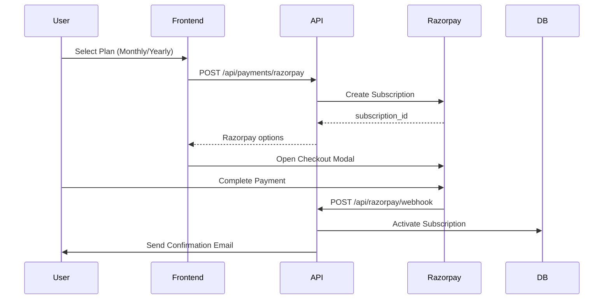

# Celite — Project Documentation

> **Domain**: [celite.in](https://celite.in)
> **Last Updated**: 2026-07-02
> **Version**: 0.1.0

---

## 1. Project Overview

**Celite** is a premium **digital assets marketplace** built with Next.js. It enables users to browse, purchase, and download a wide variety of creative assets:

| Asset Category | Route | Description |
|---|---|---|
| Video Templates | `/video-templates` | After Effects cinema/motion templates |
| Save the Date | `/save-date` | Wedding invitation video templates |
| 3D Models | `/3d-models` | Interactive 3D model assets |
| Stock Photos | `/stock-photos` | Royalty-free photography |
| Stock Music | `/stock-musics` | Royalty-free background music |
| Sound Effects | `/sound-effects` | SFX audio clips |
| AI Prompts | `/prompts` | Curated AI prompt packs |
| Graphics | `/graphics` | Design graphics & illustrations |
| Web Templates | `/web-templates` | HTML/CSS/JS website templates |

The platform supports a **subscription model** (monthly/yearly via Razorpay) with unlimited downloads, a **creator marketplace** where sellers can upload and sell their own assets, and a comprehensive **admin panel** for full platform management.

---

## 2. Technology Stack

| Layer | Technology | Version |
|---|---|---|
| **Framework** | Next.js (App Router) | ^16.0.10 |
| **Language** | TypeScript | ^5 |
| **UI Library** | React | ^19.2.3 |
| **Styling** | Tailwind CSS v4 + tw-animate-css | ^4 |
| **Animation** | Framer Motion / Motion | ^12.x |
| **Database** | Supabase (PostgreSQL) | ^2.78.0 |
| **File Storage** | Cloudflare R2 (S3-compatible) | AWS SDK v3 |
| **Payments** | Razorpay | REST API |
| **Email** | Nodemailer (SMTP via Hostinger) | ^7.0.11 |
| **3D Rendering** | Three.js | ^0.181.0 |
| **Charts** | Recharts | ^3.4.1 |
| **Analytics** | Google Analytics + Vercel Analytics | — |
| **Icons** | Lucide React + Radix Icons | — |
| **UI Primitives** | Radix UI (Dialog, Tooltip, Avatar, etc.) | — |
| **Deployment** | Netlify (with Next.js plugin) | Node 20.x |
| **SEO** | next-sitemap | ^4.2.3 |
| **Font** | Inter (Google Fonts) | — |

---

## 3. Directory Structure

```
celite-main/
├── app/                          # Next.js App Router (pages + API)
│   ├── layout.tsx                # Root layout (metadata, providers, analytics)
│   ├── page.tsx                  # Homepage (SSR with ISR, 60s revalidation)
│   ├── globals.css               # Global styles, theme tokens, animations
│   ├── not-found.tsx             # Custom 404 page
│   │
│   ├── [shopSlug]/               # Dynamic creator shop pages
│   ├── 3d-models/                # 3D models category page
│   ├── about/                    # About page
│   ├── admin/                    # Admin panel
│   │   ├── page.tsx              # Admin entry
│   │   ├── AdminClient.tsx       # Admin shell with sidebar navigation
│   │   └── components/           # 13 admin panel modules
│   │       ├── AdminSidebar.tsx
│   │       ├── AnalyticsPanel.tsx
│   │       ├── BulkSfxPanel.tsx
│   │       ├── CategoriesPanel.tsx
│   │       ├── FreeGiftsPanel.tsx
│   │       ├── MarketingPanel.tsx
│   │       ├── OverviewPanel.tsx
│   │       ├── ProductAlertsPanel.tsx
│   │       ├── ProductsPanel.tsx
│   │       ├── SettingsPanel.tsx
│   │       ├── SubscriptionLogPanel.tsx
│   │       ├── UsersPanel.tsx
│   │       └── VendorApprovalPanel.tsx
│   │
│   ├── api/                      # API Route Handlers
│   │   ├── admin/                # 21 admin API endpoints
│   │   │   ├── analytics/
│   │   │   ├── bulk-upload-sfx/
│   │   │   ├── categories/
│   │   │   ├── checkout-logs/
│   │   │   ├── creator-shops/
│   │   │   ├── fix-pongal-validity/
│   │   │   ├── fix-subscription-renewals/
│   │   │   ├── fix-subscription-timestamps/
│   │   │   ├── fix-subscription-validity/
│   │   │   ├── marketing/
│   │   │   ├── seed-templates/
│   │   │   ├── seo/
│   │   │   ├── settings/
│   │   │   ├── stats/
│   │   │   ├── sub-subcategories/
│   │   │   ├── subcategories/
│   │   │   ├── templates/
│   │   │   ├── upload-assets/
│   │   │   ├── upload-file/
│   │   │   ├── upload-r2/
│   │   │   └── users/
│   │   ├── audio-preview/
│   │   ├── checkout/
│   │   ├── creator/              # Creator API (autofill, uploads, templates)
│   │   ├── download/
│   │   ├── getFileUrl/
│   │   ├── maintenance/
│   │   ├── payments/razorpay/
│   │   ├── pongal-weekly/
│   │   ├── profile/
│   │   ├── purchase/
│   │   ├── razorpay/webhook/
│   │   └── subscription/        # activate, cancel, check-expiry, renew
│   │
│   ├── auth/callback/            # OAuth callback handler
│   ├── checkout/                 # Checkout flow pages
│   ├── contact/                  # Contact page
│   ├── creator/dashboard/        # Creator dashboard (89KB — large panel)
│   ├── dashboard/                # User dashboard
│   ├── forgot-password/
│   ├── graphics/
│   ├── login/
│   ├── music-sfx/
│   ├── pricing/                  # Subscription pricing page
│   ├── privacy-policy/
│   ├── product/[slug]/           # Product detail page (SSR)
│   ├── prompts/
│   ├── refund-policy/
│   ├── reset-password/
│   ├── save-date/
│   ├── shipping-policy/
│   ├── signup/
│   ├── sound-effects/
│   ├── start-selling/
│   ├── stock-musics/
│   ├── stock-photos/
│   ├── templates/                # All-templates listing
│   ├── terms/
│   ├── video-templates/
│   └── web-templates/
│
├── components/                   # 51 shared React components
│   ├── Header.tsx                # Global navigation header (18KB)
│   ├── Footer.tsx                # Site footer
│   ├── Hero.tsx                  # Homepage hero section
│   ├── LayoutWrapper.tsx         # Conditional header/footer rendering
│   ├── LatestTemplatesCarousel.tsx
│   ├── CinemaTemplatesShowcase.tsx
│   ├── SaveDateTemplatesShowcase.tsx
│   ├── RoyaltyFreeMusicShowcase.tsx
│   ├── SfxShowcase.tsx
│   ├── WebsiteShowcaseCarousel.tsx
│   ├── VideoThumbnailPlayer.tsx  # Video preview with auto-play
│   ├── SimpleMusicPlayer.tsx     # Audio playback component
│   ├── MusicSfxPlayer.tsx        # Combined music/SFX player
│   ├── Model3DViewer.tsx         # Three.js 3D model viewer
│   ├── StockPhotoViewer.tsx
│   ├── GoogleAnalytics.tsx
│   ├── Pricing.tsx
│   ├── FAQSection.tsx / FAQAndSubscribe.tsx
│   ├── ContactForm.tsx
│   ├── LoginModal.tsx
│   ├── SnowEffect.tsx            # Seasonal snow animation
│   ├── CreatorFollowButton.tsx
│   ├── animated-cards-stack.tsx
│   ├── liquid-glass-button.tsx
│   ├── spotlight-card.tsx
│   ├── web-gl-shader.tsx
│   └── ui/                       # 33 reusable UI primitives
│       ├── button.tsx, card.tsx, badge.tsx
│       ├── avatar.tsx, tooltip.tsx
│       ├── navigation-menu.tsx, navbar-menu.tsx
│       ├── loading-spinner.tsx, loading-spinner-server.tsx
│       ├── rainbow-button.tsx, neon-button.tsx, shiny-button.tsx
│       ├── glowing-effect.tsx
│       ├── text-reveal.tsx, scroll-expansion-hero.tsx
│       ├── database-with-rest-api.tsx
│       ├── radial-orbital-timeline.tsx
│       ├── sign-in.tsx, demo.tsx, dock.tsx
│       ├── tubes-cursor.tsx, web-gl-shader.tsx
│       └── ...more
│
├── context/                      # React Context Providers
│   ├── AppContext.tsx             # Auth state, cart, user management
│   └── LoginModalContext.tsx      # Login modal visibility control
│
├── lib/                          # Core utility libraries
│   ├── supabaseClient.ts         # Browser-side Supabase (singleton)
│   ├── supabaseServer.ts         # Server-side Supabase (anon key)
│   ├── supabaseAdmin.ts          # Admin Supabase (service role key)
│   ├── r2Client.ts               # Cloudflare R2 (S3) operations
│   ├── r2Multipart.ts            # Multipart R2 uploads
│   ├── razorpay.ts               # Razorpay credentials & API wrapper
│   ├── emailService.ts           # SMTP email templates & sending
│   ├── priceUtils.ts             # Currency unit conversions (paise/cents)
│   ├── currency.ts               # Price formatting (INR/USD)
│   ├── gtag.ts                   # Google Analytics event tracking
│   ├── imageCompression.ts       # Client-side image compression
│   └── utils.ts                  # General utilities (cn, etc.)
│
├── data/                         # Static data
│   ├── templateData.js           # Legacy template data
│   └── templateData.d.ts         # Type definitions
│
├── scripts/                      # Utility scripts
│   ├── generate-whoosh-direct.ts  # SFX generation script
│   └── generate-whoosh-sfx.ts
│
├── public/                       # Static assets
│   ├── favicon/, logo/
│   ├── hero images, team photos
│   ├── robots.txt, sitemap.xml
│   └── SVG icons
│
├── supabase_migrations/          # 52 SQL migration files
│   ├── 00_complete_fresh_setup.sql  # Full schema bootstrap
│   ├── 01–31: incremental migrations
│   └── Various fix/utility scripts
│
├── next.config.ts                # Next.js configuration
├── tsconfig.json                 # TypeScript config
├── package.json                  # Dependencies & scripts
├── netlify.toml                  # Netlify deployment config
├── next-sitemap.config.js        # Dynamic sitemap generation
├── components.json               # shadcn/ui config
├── eslint.config.mjs             # ESLint config
├── postcss.config.mjs            # PostCSS (Tailwind)
└── .env.local                    # Environment variables (not committed)
```

---

## 4. Database Schema

The database is **Supabase (PostgreSQL)** with **Row Level Security (RLS)** enabled on all tables.

### Core Tables

```mermaid
erDiagram
    templates {
        text slug PK
        text name
        text subtitle
        text description
        decimal price
        text img "DEPRECATED"
        text video "YouTube URL"
        text source_path "R2 private bucket key"
        text video_path "R2 preview video"
        text thumbnail_path "R2 thumbnail"
        text audio_preview_path "R2 audio preview"
        text model_3d_path "R2 3D model"
        jsonb features
        jsonb software
        jsonb plugins
        jsonb tags
        boolean is_featured
        text status "approved/pending/rejected"
        uuid category_id FK
        uuid subcategory_id FK
        uuid sub_subcategory_id FK
        uuid creator_id FK
        text meta_title
        text meta_description
    }

    categories {
        uuid id PK
        text name UK
        text slug UK
        text description
        text icon
    }

    subcategories {
        uuid id PK
        uuid category_id FK
        text name
        text slug
    }

    sub_subcategories {
        uuid id PK
        uuid subcategory_id FK
        text name
        text slug
    }

    subscriptions {
        uuid id PK
        uuid user_id FK UK
        boolean is_active
        text plan "monthly/yearly"
        timestamptz valid_until
        text razorpay_subscription_id
        boolean autopay_enabled
        boolean expiry_email_sent
    }

    orders {
        uuid id PK
        uuid user_id FK
        decimal total
        text status "pending/paid/failed"
        text billing_name
        text billing_email
    }

    order_items {
        uuid id PK
        uuid order_id FK
        text slug
        text name
        decimal price
    }

    admins {
        uuid id PK
        uuid user_id FK UK
    }

    settings {
        uuid id PK
        text key UK
        text value
        text description
    }

    creator_shops {
        uuid id PK
        uuid user_id FK
        text shop_name
        text shop_slug UK
        boolean direct_upload
    }

    creator_followers {
        uuid id PK
        uuid follower_id FK
        uuid creator_id FK
    }

    downloads {
        uuid id PK
        uuid user_id FK
        text template_slug FK
        timestamptz downloaded_at
    }

    free_downloads {
        uuid id PK
        uuid user_id FK
        text template_slug FK
    }

    checkout_details {
        uuid id PK
        uuid user_id FK
        text name
        text email
        text phone
        text country
    }

    categories ||--o{ subcategories : has
    subcategories ||--o{ sub_subcategories : has
    categories ||--o{ templates : contains
    subcategories ||--o{ templates : contains
    orders ||--o{ order_items : contains
```

### RLS Policies Summary

| Table | Public Read | User Own | Admin Write |
|---|---|---|---|
| `templates` | ✅ SELECT | — | ✅ INSERT/UPDATE/DELETE |
| `categories` | ✅ SELECT | — | ✅ ALL |
| `subcategories` | ✅ SELECT | — | ✅ ALL |
| `orders` | — | ✅ SELECT/INSERT | ✅ UPDATE |
| `order_items` | — | ✅ via order FK | — |
| `subscriptions` | — | ✅ SELECT/UPDATE | ✅ service_role |
| `admins` | — | — | ✅ via `is_admin()` |
| `settings` | ✅ SELECT | — | ✅ ALL |

Admin checks use a `SECURITY DEFINER` function `public.is_admin(user_id)` to avoid RLS recursion.

---

## 5. Authentication & Authorization

### Architecture

| Layer | Client | Method |
|---|---|---|
| Browser-side | `supabaseClient.ts` | Anon key, persistent session |
| Server Components | `supabaseServer.ts` | Anon key, no session persistence |
| API Routes (admin) | `supabaseAdmin.ts` | Service role key (bypasses RLS) |

### Auth Flows

1. **Email/Password Sign-up** → `supabase.auth.signUp()` → email confirmation
2. **Email/Password Login** → `supabase.auth.signInWithPassword()`
3. **OAuth Callback** → `/auth/callback/` route handler
4. **Password Reset** → `/forgot-password` → `/reset-password`
5. **Session Management** → `AppContext` subscribes to `onAuthStateChange`

### Admin Authorization
- Admin status is checked via the `admins` table (`user_id` FK to `auth.users`)
- API routes use `supabaseAdmin` (service role) and verify admin status before proceeding
- RLS policies use `public.is_admin(auth.uid())` for database-level enforcement

---

## 6. API Routes Reference

### Admin APIs (`/api/admin/`)

| Endpoint | Purpose |
|---|---|
| `analytics/` | Dashboard analytics data |
| `bulk-upload-sfx/` | Batch SFX file upload |
| `categories/` | CRUD for categories |
| `checkout-logs/` | View checkout history |
| `creator-shops/` | Manage creator shops |
| `fix-pongal-validity/` | Fix Pongal subscription dates |
| `fix-subscription-renewals/` | Repair renewal records |
| `fix-subscription-timestamps/` | Correct timestamp issues |
| `fix-subscription-validity/` | Fix validity periods |
| `marketing/` | Marketing email campaigns |
| `seed-templates/` | Seed template data |
| `seo/` | SEO meta management |
| `settings/` | App settings CRUD |
| `stats/` | Dashboard statistics |
| `sub-subcategories/` | Manage sub-subcategories |
| `subcategories/` | Manage subcategories |
| `templates/` | Template CRUD |
| `upload-assets/` | Upload template assets |
| `upload-file/` | General file upload |
| `upload-r2/` | Direct R2 upload |
| `users/` | User management |

### Public/User APIs

| Endpoint | Purpose |
|---|---|
| `audio-preview/` | Stream audio previews |
| `checkout/` | Process checkout |
| `checkout/details/` | Save checkout billing info |
| `creator/autofill/` | Auto-fill creator profile |
| `creator/chunked-upload/` | Chunked file upload for creators |
| `creator/templates/` | Creator template management |
| `creator/upload-r2/` | Creator R2 uploads |
| `download/[slug]/` | Secure file download |
| `getFileUrl/` | Generate signed R2 URLs |
| `maintenance/` | Maintenance mode check |
| `payments/razorpay/` | Create Razorpay payment |
| `pongal-weekly/` | Pongal weekly subscription |
| `profile/` | User profile management |
| `purchase/` | Record purchases |
| `razorpay/webhook/` | Razorpay webhook handler |
| `subscription/activate/` | Activate subscription |
| `subscription/cancel/` | Cancel subscription |
| `subscription/check-expiry/` | Check expiry + send emails |
| `subscription/renew/` | Renew subscription |

---

## 7. File Storage Architecture

### Dual-Bucket System (Cloudflare R2)

```
┌─────────────────────────────┐    ┌─────────────────────────────┐
│   celite-source-files       │    │   celite-previews           │
│   (PRIVATE bucket)          │    │   (PUBLIC bucket)           │
│                             │    │                             │
│ • Source files (.aep, .zip) │    │ • Thumbnails (.jpg, .webp)  │
│ • Download via signed URLs  │    │ • Video previews (.mp4)     │
│ • No public access          │    │ • Audio previews (.mp3)     │
│                             │    │ • 3D model previews (.glb)  │
│                             │    │ • Domain: preview.celite.in │
└─────────────────────────────┘    └─────────────────────────────┘
```

### Key Path Convention

```
Source:  {category}/{subcategory}/{sub-subcategory}/{template-folder}/{filename}
Preview: preview/{type}/{category}/{subcategory}/{sub-subcategory}/{template-folder}/{filename}
```

Where `{type}` is one of: `thumbnail`, `video`, `audio`, `model`.

### Key Functions (`lib/r2Client.ts`)

| Function | Purpose |
|---|---|
| `uploadSourceToR2()` | Upload to private bucket |
| `uploadPreviewToR2()` | Upload to public bucket |
| `getSourceFileFromR2()` | Retrieve private file |
| `getSignedSourceUrl()` | Generate time-limited download URL |
| `getPresignedUploadUrl()` | Generate pre-signed upload URL |
| `generateSourceKey()` | Build source file key path |
| `generatePreviewKey()` | Build preview file key path |

---

## 8. Payment & Subscription System

### Payment Flow (Razorpay)



### Subscription Plans

| Plan | INR (paise) | USD (cents) | Display |
|---|---|---|---|
| Monthly | 79,900 | 900 | ₹799 / $9 |
| Yearly | 5,49,900 | 5,900 | ₹5,499 / $59 |

### Subscription Lifecycle
1. **Activate** → `/api/subscription/activate` → Sets `is_active=true`, `valid_until`
2. **Webhook Renewal** → `/api/razorpay/webhook` → Extends `valid_until`
3. **Expiry Check** → `/api/subscription/check-expiry` → Sends warning email
4. **Cancel** → `/api/subscription/cancel` → Cancels via Razorpay API, updates DB

---

## 9. Email Notification System

Built with **Nodemailer** via SMTP (Hostinger). Templates defined in `lib/emailService.ts`.

| Email Type | Trigger | Recipients |
|---|---|---|
| Subscription Success | New subscription activation | User + Admin |
| Payment Received | Recurring payment processed | User + Admin |
| Subscription Expiring | Approaching `valid_until` | User |
| Subscription Cancelled | User cancels | User + Admin |
| Marketing Email | Admin-triggered campaign | Target users |

Admin notification email: `celiteproofficial@gmail.com`

---

## 10. SEO Infrastructure

- **Metadata**: Every page exports `Metadata` objects with title, description, keywords, OG tags
- **Structured Data**: JSON-LD schemas for `WebSite`, `Organization`, `SiteNavigationElement`, products
- **Sitemap**: Dynamic sitemap via `next-sitemap` pulling all approved templates from Supabase
- **Robots.txt**: Auto-generated, blocks `/admin`, `/api`, `/dashboard`, `/checkout`, auth pages
- **ISR**: Homepage uses `revalidate = 60` for edge caching
- **Google Analytics**: GA4 with custom e-commerce event tracking
- **Google Ads**: AdSense integration via `pagead2.googlesyndication.com`
- **Vercel Analytics**: Speed Insights + Analytics components

---

## 11. Deployment

### Netlify Configuration

```toml
[build]
  command = "npm ci && npm run build"
  publish = ".next"

[build.environment]
  NODE_VERSION = "20"

[[plugins]]
  package = "@netlify/plugin-nextjs"
```

### Build Scripts

| Script | Command |
|---|---|
| `dev` | `next dev` |
| `build` | `next build` |
| `postbuild` | `next-sitemap` |
| `start` | `next start` |
| `lint` | `eslint` |

---

## 12. Environment Variables Reference

| Variable | Purpose | Required |
|---|---|---|
| `NEXT_PUBLIC_SUPABASE_URL` | Supabase project URL | ✅ |
| `NEXT_PUBLIC_SUPABASE_ANON_KEY` | Supabase anonymous key | ✅ |
| `SUPABASE_SERVICE_ROLE_KEY` | Supabase service role (admin) | ✅ |
| `RAZORPAY_KEY_ID` | Razorpay API key | ✅ |
| `RAZORPAY_KEY_SECRET` | Razorpay API secret | ✅ |
| `RAZORPAY_CURRENCY` | Payment currency (INR/USD) | ❌ |
| `RAZORPAY_MONTHLY_AMOUNT` | Monthly plan (paise) | ❌ |
| `RAZORPAY_YEARLY_AMOUNT` | Yearly plan (paise) | ❌ |
| `R2_ACCOUNT_ID` | Cloudflare account ID | ✅ |
| `R2_ENDPOINT` | R2 endpoint (auto-derived) | ❌ |
| `R2_ACCESS_KEY_ID` | R2 access key | ✅ |
| `R2_SECRET_ACCESS_KEY` | R2 secret key | ✅ |
| `R2_SOURCE_BUCKET` | Private bucket name | ❌ |
| `R2_PREVIEWS_BUCKET` | Public bucket name | ❌ |
| `R2_PREVIEWS_DOMAIN` | Preview CDN domain | ❌ |
| `SMTP_HOST` | Email SMTP host | ✅ |
| `SMTP_PORT` | SMTP port | ❌ |
| `SMTP_USER` | SMTP username | ✅ |
| `SMTP_PASSWORD` | SMTP password | ✅ |
| `EMAIL_FROM` | Sender email address | ❌ |
| `EMAIL_FROM_NAME` | Sender display name | ❌ |
| `NEXT_PUBLIC_GA_MEASUREMENT_ID` | Google Analytics ID | ❌ |
| `GOOGLE_SITE_VERIFICATION` | Google Search Console | ❌ |
| `NEXT_PUBLIC_SITE_URL` | Public site URL | ❌ |

---

## 13. Design System

### Theme

- **Light Mode**: Warm cream background (`#fdf8f3`), blue primary (`#2563eb`)
- **Dark Mode**: Zinc-950 background (`#09090b`), purple primary (`#5b21b6`)
- **Font**: Inter (variable font, weights 400–700)
- **Border Radius**: `0.5rem` base with `sm/md/lg/xl` variants
- **Custom Cursor**: Black 2D arrow SVG cursor
- **Scrollbar**: 5px thin, themed colors

### Animation Library

| Animation | Description |
|---|---|
| `fadeSlideIn` | Fade + blur + translateY entrance |
| `slideRightIn` | Fade + blur + translateX entrance |
| `testimonialIn` | Fade + blur + scale entrance |
| `snowfall` | Seasonal falling snow effect |
| `marquee` | Horizontal infinite scroll |
| `rainbow` | Rainbow gradient animation |

---

## 14. Key Architectural Patterns

1. **Server/Client Split**: Pages use SSR (`async function`) with data fetching, then pass data to `*Client.tsx` interactive components
2. **Singleton Clients**: Supabase and R2 clients use module-level singletons
3. **ISR Caching**: Homepage revalidates every 60 seconds
4. **Cart State**: Client-side only (no DB persistence), managed via React Context
5. **Admin Verification**: Admin API routes verify via `supabaseAdmin` → `admins` table lookup
6. **Dual Bucket Storage**: Private (source files) + Public (previews) R2 buckets
7. **Price Storage**: All prices stored in smallest currency unit (paise/cents)
8. **Creator Marketplace**: Creators get shops (`[shopSlug]`), can upload templates (pending approval)
