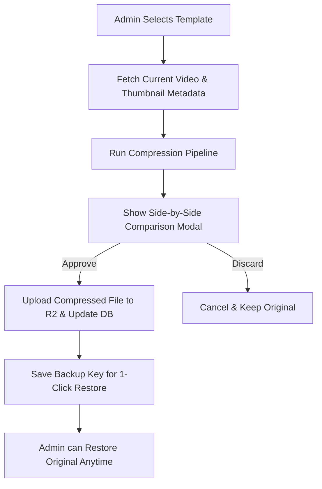

<!-- agent-notes: { ctx: "Admin panel media compressor & Cloudflare R2 backup plan", deps: ["app/admin/AdminClient.tsx", "lib/r2Client.ts", "lib/utils.ts"], state: complete, last: "sato@2026-07-28" } -->
# Implementation Plan: Admin Panel Media Compressor & R2 Optimizer

**Goal:** Provide an interactive Media Compression & Preview Optimization panel in the Celite Admin Dashboard. Admin can select template video previews (`video_path`) and thumbnails (`thumbnail_path` / `img`), generate compressed WebP/MP4 versions, preview side-by-side with file size savings, approve & push to Cloudflare R2, or restore originals with 1-click.

---

## 1. Goal & Product Vision

- **Faster Page Load Speeds:** Heavily uncompressed video previews (e.g. 30MB-100MB MP4 files) and large PNG thumbnails degrade page load times and mobile web performance.
- **Admin Control & Visual Verification:** Admin must be able to visually inspect compressed videos and thumbnails side-by-side with originals before committing changes to Cloudflare R2.
- **Safety Net (1-Click Restore):** Automatic backup of original R2 assets allowing instant 1-click restore if compression loses necessary visual detail.

---

## 2. Constraints & Architectural Considerations

- **Storage Provider:** Cloudflare R2 (`celite-previews` bucket with custom domain `preview.celite.in` or `cdn.celite.in`).
- **Processing Capabilities:** Next.js Server Components / API Routes + Client-side OffscreenCanvas / Canvas WebP conversion for thumbnails & FFmpeg.wasm / server-side API for video transcoding.
- **Authentication & Authorization:** All compression, R2 upload, and database update routes MUST be protected by Supabase admin session checks (`admins` table).

---

## 3. Architecture Gate Scan

| Feature Component | Architectural Decision? | Reason | Action Required |
|---|---|---|---|
| **R2 Asset Versioning & Restore Strategy** | Yes | Changes asset storage structure in Cloudflare R2 & DB columns for backup paths | Architecture Gate (ADR required for R2 backup key naming convention) |
| **Video Compression Engine Choice** | Yes | FFmpeg WebAssembly vs Server API route for video transcoding | Architecture Gate (ADR required for client vs server transcoding boundary) |
| **Admin UI Component & API endpoints** | No | Standard React component & Next.js API route extension | Direct Implementation |

---

## 4. Proposed Technical Approach

### Component & API Layer

#### [NEW] [MediaCompressorPanel.tsx](file:///d:/cp/NC/celite-main/celite-main/app/admin/components/MediaCompressorPanel.tsx)
- New tab in Admin Dashboard navigation (`active === 'mediaCompressor'`).
- Lists all templates with columns:
  - Template Name & Category
  - Original Video Size & Thumbnail Size
  - Compression Status (`Uncompressed`, `Compressed (-65%)`, `Restored`)
  - Action Buttons: `[Compress & Inspect]`, `[1-Click Restore]`
- Batch compression selector for batch processing uncompressed assets.

#### [NEW] [route.ts](file:///d:/cp/NC/celite-main/celite-main/app/api/admin/media/compress/route.ts)
- API endpoint to process video / image previews server-side or validate client-compressed uploads.
- Generates compressed buffers (WebP for images, H.264 720p/1080p MP4 for video).

#### [NEW] [route.ts](file:///d:/cp/NC/celite-main/celite-main/app/api/admin/media/restore/route.ts)
- API endpoint to restore template's original video/thumbnail path from R2 backup location.

#### [MODIFY] [AdminSidebar.tsx](file:///d:/cp/NC/celite-main/celite-main/app/admin/components/AdminSidebar.tsx) & [AdminClient.tsx](file:///d:/cp/NC/celite-main/celite-main/app/admin/AdminClient.tsx)
- Register `mediaCompressor` tab in sidebar with Lucide icon (`Sliders` / `FileArchive`).

---

## 5. Personas Involved

- **Cam (Discovery & Vision)**: Ensures Admin UI is intuitive, with clear savings metrics (% size reduction, original vs compressed video comparison).
- **Archie (Architecture)**: Drafts ADR for R2 backup asset keying strategy (`previews/originals/{slug}-preview.mp4`).
- **Sato (Lead Implementation)**: Implements UI, client-side WebP converter, server compression API, and R2 sync logic.
- **Tara (Testing)**: Writes unit tests for image/video compression utility helpers and API routes.
- **Pierrot (Security)**: Verifies Admin authentication checks on all media upload/restore routes.

---

## 6. Open Questions & Elicitation

1. **Target Video Resolution & Bitrate**: Should preview videos default to 720p 30fps H.264 (recommended for optimal streaming performance) or offer quality options (480p, 720p, 1080p)?
2. **Thumbnail Format**: Should compressed thumbnails convert automatically to WebP with 82% quality fallback to JPEG?

---

## 7. Acceptance Criteria

- [ ] Admin panel has a dedicated **"Media Compressor"** tab under Admin Dashboard.
- [ ] Displays exact file sizes for original video preview & thumbnail images.
- [ ] Renders side-by-side visual comparison (Original vs Compressed) with live size reduction percentage.
- [ ] **Approve & Sync**: 1-click upload to Cloudflare R2 preview bucket, updating Supabase DB record instantly.
- [ ] **1-Click Restore**: Backup retained so Admin can revert to the uncompressed original at any time.
- [ ] Covered by automated unit and API endpoint tests.
